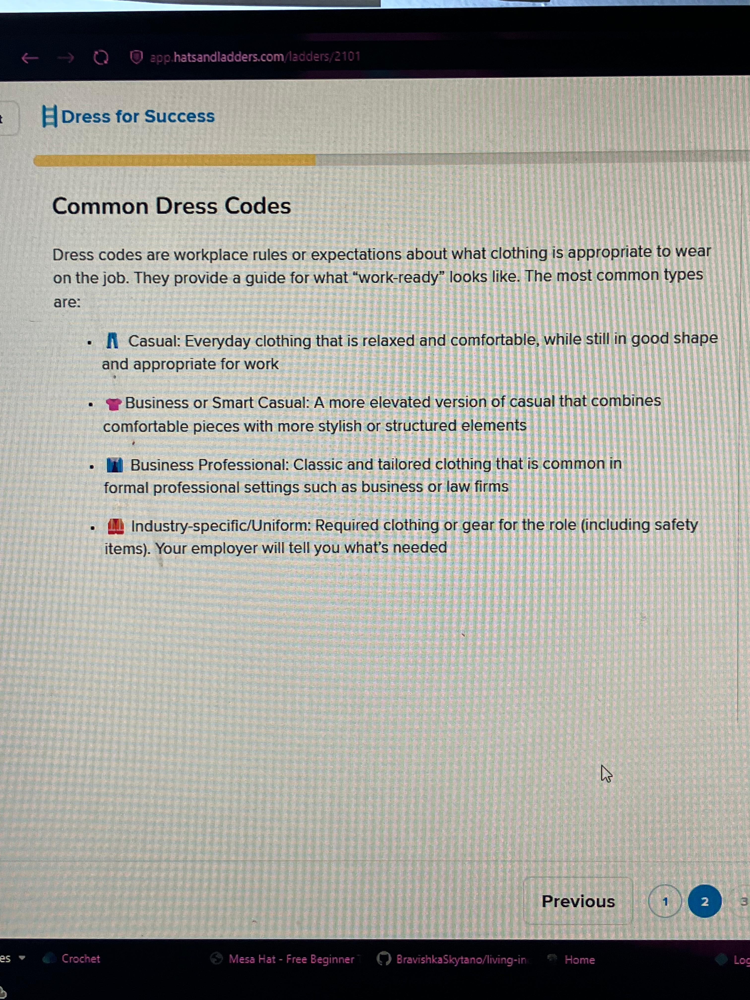

# May 29, 2026

02:05

---

[Untitled - Notes](../Images/Untitled%20(8).md)

---

.jpeg)
[Untitled - Notes](../Images/Untitled%20(24).md)

---

.jpeg)
[Untitled - Notes](../Images/Untitled%20(14).md)

---

.jpeg)
[Untitled - Notes](../Images/Untitled%20(26).md)

---

02:06

I’m trying to finish up some of the course on Hats & Ladders. I shouldn’t stay up too long though, already starting to get a headache. Glad I don’t have to be somewhere in the morning.

15:00

I feel sick. It's probably because I haven't eaten much, and there's no drinking water in the apartment. Joshua went out and I asked him to bring back some food, but he's gonna be an hour at least. Ughhhh I have that SYEP Zoom meeting in an hour, can't be sick.

